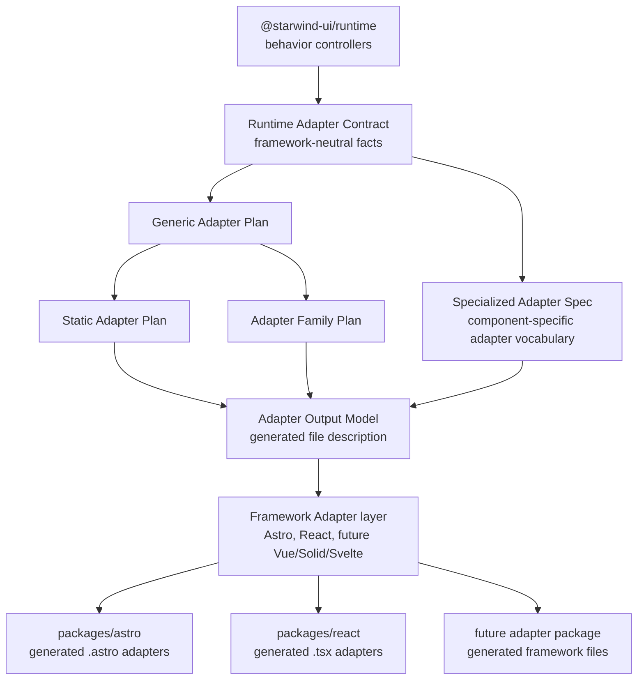

<p align="center">
  
</p>

<p align="center">
  <a href="https://github.com/starwind-ui/starwind-ui"></a>
  <!-- <a href="https://www.npmjs.com/package/starwind"></a>
  <a href="https://github.com/starwind-ui/starwind-ui"></a> -->
  <a href="https://www.npmjs.com/package/starwind"></a>
  <a href="https://x.com/boston343builds"></a>
</p>

**Astro-first, framework-portable UI components you can own.**

Starwind UI gives you accessible, Tailwind CSS components with Starwind/shadcn-style ergonomics,
backed by a portable Runtime that powers Astro and React adapters today.

**[Get Started →](https://starwind.dev/docs/getting-started/installation/)** &nbsp;|&nbsp; **[Explore Components](https://starwind.dev/docs/components/)**

## Why Starwind?

- **🎯 Own Your Code** — Components live in your project, not hidden in `node_modules`. Customize everything.
- **✨ Animated by Default** — Smooth, polished animations out of the box with Tailwind CSS v4.
- **♿ Accessible** — Keyboard navigable and screen reader friendly. Built with a11y in mind.
- **🚀 Portable Runtime** — Shared DOM behavior with generated Astro and React adapters.
- **🛠️ CLI-Powered** — Add only what you need with a simple `npx starwind add` command.

> Looking for the main package? See [starwind-ui/cli](/packages/cli/README.md).

## Quick Start

The portable Runtime is currently available through the `beta` channel for Astro and React:

```bash
npx starwind@beta init
```

Color Picker is not part of the Runtime beta. Existing Astro projects can migrate its recognized
legacy implementation through a compatibility bridge, but fresh Runtime and React installs do not
include it.

### Initialize your project

```bash
npx starwind@latest init
```

### Select components to add

```bash
npx starwind@latest add
```

## Runtime Architecture

Runtime behavior is framework-neutral. Adapter contracts and plans describe the component facts,
the Adapter Output Model describes the generated files, and target Framework Adapters turn that
model into Astro, React, and future framework packages.



See [Portable Runtime](docs/portable-runtime/README.md) for the current implementation details.

## AI integration

Resources for AI:

- [Starwind Skills](https://starwind.dev/docs/getting-started/skills/)
- [MCP server](https://starwind.dev/docs/getting-started/mcp/)
- [llms.txt](https://starwind.dev/llms.txt)
- [llms-full.txt](https://starwind.dev/llms-full.txt)

## Contributing

Please read the [contributing guide](/CONTRIBUTING.md).

## License

Licensed under the [MIT license](/LICENSE).
