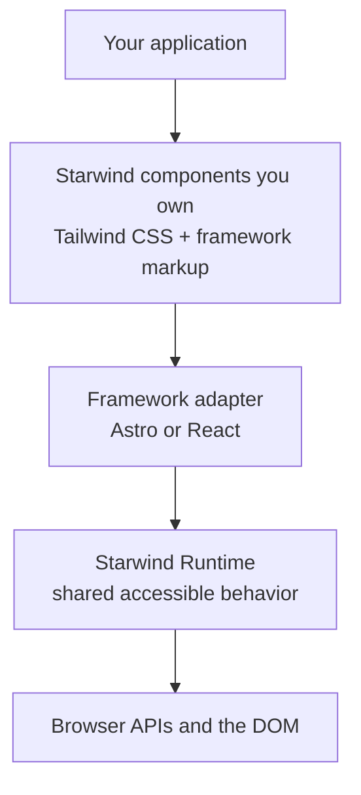

<p align="center">
  
</p>

<p align="center">
  <a href="https://github.com/starwind-ui/starwind-ui"></a>
  <!-- <a href="https://www.npmjs.com/package/starwind"></a>
  <a href="https://github.com/starwind-ui/starwind-ui"></a> -->
  <a href="https://www.npmjs.com/package/starwind"></a>
  <a href="https://x.com/boston343builds"></a>
</p>

**Astro-first, framework-portable UI components you can own.**

Starwind UI gives you accessible, Tailwind CSS components with Starwind/shadcn-style ergonomics,
backed by a portable Runtime that powers Astro and React adapters today.

**[Explore Components](https://starwind.dev/docs/components/)**

## Why Starwind?

- **🎯 Own Your Code** — Styled components live in your project, where you can understand and customize them.
- **✨ Animated by Default** — Smooth, polished animations out of the box with Tailwind CSS v4.
- **♿ Accessible** — Keyboard navigable and screen reader friendly. Built with a11y in mind.
- **🚀 Portable Runtime** — Shared DOM behavior with generated Astro and React adapters.
- **🛠️ CLI-Powered** — Add only what you need with a simple `npx starwind add` command.

> Looking for the main package? See [starwind-ui/cli](/packages/cli/README.md).

## Runtime Beta — Astro and React

The portable Runtime is currently available through the `beta` channel for Astro and React:

```bash
npx starwind@beta init
```

## Stable — Astro

Initialize an Astro project with the current stable release:

```bash
npx starwind@latest init
```

Then select components to add:

```bash
npx starwind@latest add
```

## Runtime Architecture

Starwind components use a framework adapter backed by the shared, framework-neutral Runtime.



See [Portable Runtime](docs/portable-runtime/README.md) for the current implementation details.

## Built with Codex and GPT-5.6

Starwind UI existed before OpenAI Build Week. During the submission period beginning July 13,
2026, I used Codex with GPT-5.6 as my primary engineering collaborator to materially extend and
harden the portable Runtime beta. GPT-5.6 is part of the development workflow through Codex; it is
not a runtime dependency of the components that Starwind users install.

Codex accelerated work across the project:

- **Architecture and decisions** — Codex helped inspect the existing system, compare alternatives,
  stress-test boundaries, and document decisions such as the DOM-first Runtime, separate Primitive
  and styled adapter layers, framework target homes, and native-first form behavior.
- **Implementation** — I used Codex to turn approved specs into dependency-aware tickets, implement
  them in isolated Git worktrees, and independently review each slice. During Build Week this
  included Color Picker productization, tighter Runtime boundaries, cross-framework lifecycle
  fixes, public documentation work, and release hardening.
- **Testing and debugging** — Codex built focused reproduction loops and regression coverage across
  Runtime unit tests, Playwright browser tests, deterministic generator tests, CLI and registry
  tests, Astro and React demos, and published-package acceptance fixtures.
- **Performance and package discipline** — Codex helped create and interpret repeatable browser
  benchmarks, minified-and-gzipped bundle comparisons, tree-shaking checks, and release-blocking
  size budgets instead of relying on intuition about performance.
- **Durable agent workflows** — Project-specific Codex skills, context documents, specs, ticket
  queues, reviewer contracts, and completion evidence keep architectural knowledge available across
  sessions and make future changes safer for both humans and agents.

The key decisions and results are visible in the
[portable Runtime documentation](docs/portable-runtime/README.md),
[architecture decisions](docs/portable-runtime/decisions.md),
[performance comparison](docs/portable-runtime/runtime-performance-comparison.md),
[package-size comparison](docs/portable-runtime/package-size-comparison.md), and the repository's
[commit history](https://github.com/starwind-ui/starwind-ui/commits/main/).

## AI integration

Resources for AI:

- [Starwind Skills](https://starwind.dev/docs/getting-started/skills/)
- [MCP server](https://starwind.dev/docs/getting-started/mcp/)
- [llms.txt](https://starwind.dev/llms.txt)
- [llms-full.txt](https://starwind.dev/llms-full.txt)

## Contributing

Please read the [contributing guide](/CONTRIBUTING.md).

## License

Licensed under the [MIT license](/LICENSE).
