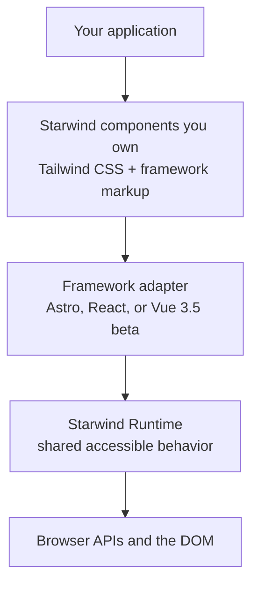

<p align="center">
  
</p>

<p align="center">
  <a href="https://github.com/starwind-ui/starwind-ui"></a>
  <!-- <a href="https://www.npmjs.com/package/starwind"></a>
  <a href="https://github.com/starwind-ui/starwind-ui"></a> -->
  <a href="https://www.npmjs.com/package/starwind"></a>
  <a href="https://x.com/boston343builds"></a>
</p>

**Astro-first, framework-portable UI components you can own.**

Starwind UI gives you accessible, Tailwind CSS components with Starwind/shadcn-style ergonomics,
backed by a portable Runtime that powers Astro, React, and Vue 3.5 beta adapters today.

**[Explore Components](https://starwind.dev/docs/components/)**

## Why Starwind?

- **🎯 Own Your Code** — Styled components live in your project, where you can understand and customize them.
- **✨ Animated by Default** — Smooth, polished animations out of the box with Tailwind CSS v4.
- **♿ Accessible** — Keyboard navigable and screen reader friendly. Built with a11y in mind.
- **🚀 Portable Runtime** — Shared DOM behavior with generated Astro, React, and Vue 3.5 beta adapters.
- **🛠️ CLI-Powered** — Add only what you need with a simple `npx starwind add` command.

> Looking for the main package? See [starwind-ui/cli](/packages/cli/README.md).

## Get Started

Initialize an Astro or React project with the stable release:

```bash
npx starwind@latest init
```

Then add the components you need:

```bash
npx starwind@latest add
```

### Vue 3.5 beta

Try the public beta in Vite Vue, Astro Vue, Nuxt 3 or 4, Laravel with Inertia Vue, or Quasar Vite
SPA/SSR projects:

```bash
npm install @starwind-ui/vue@beta vue@^3.5
npx starwind@latest init --framework vue
```

Vue adapters use idiomatic `v-model` arguments, matching `update:*` events, and normal detailed
event listeners. The Styled Image component remains Astro-only. The Vue API can change during the
`0.x` series. Report beta feedback in the
[Starwind UI issue tracker](https://github.com/starwind-ui/starwind-ui/issues).

## Runtime Architecture

Starwind components use a framework adapter backed by the shared, framework-neutral Runtime.


```mermaid
flowchart TD
  App["Your application"]
  Components["Starwind components you own<br/>Tailwind CSS + framework markup"]
  Adapter["Framework adapter<br/>Astro, React, or Vue 3.5 beta"]
  Runtime["Starwind Runtime<br/>shared accessible behavior"]
  Browser["Browser APIs and the DOM"]

  App --> Components
  Components --> Adapter
  Adapter --> Runtime
  Runtime --> Browser
```

See [Portable Runtime](docs/portable-runtime/README.md) for the current implementation details.

## AI integration

Resources for AI:

- [Starwind Skills](https://starwind.dev/docs/getting-started/skills/)
- [MCP server](https://starwind.dev/docs/getting-started/mcp/)
- [llms.txt](https://starwind.dev/llms.txt)
- [llms-full.txt](https://starwind.dev/llms-full.txt)

## Contributing

Please read the [contributing guide](/CONTRIBUTING.md).

## License

Licensed under the [MIT license](/LICENSE).
