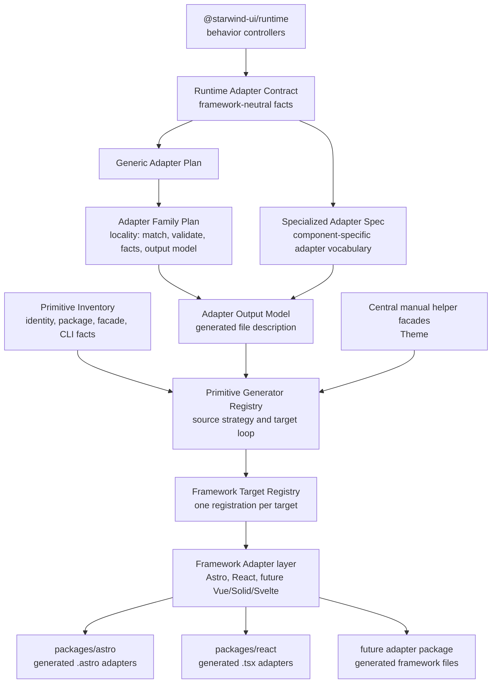
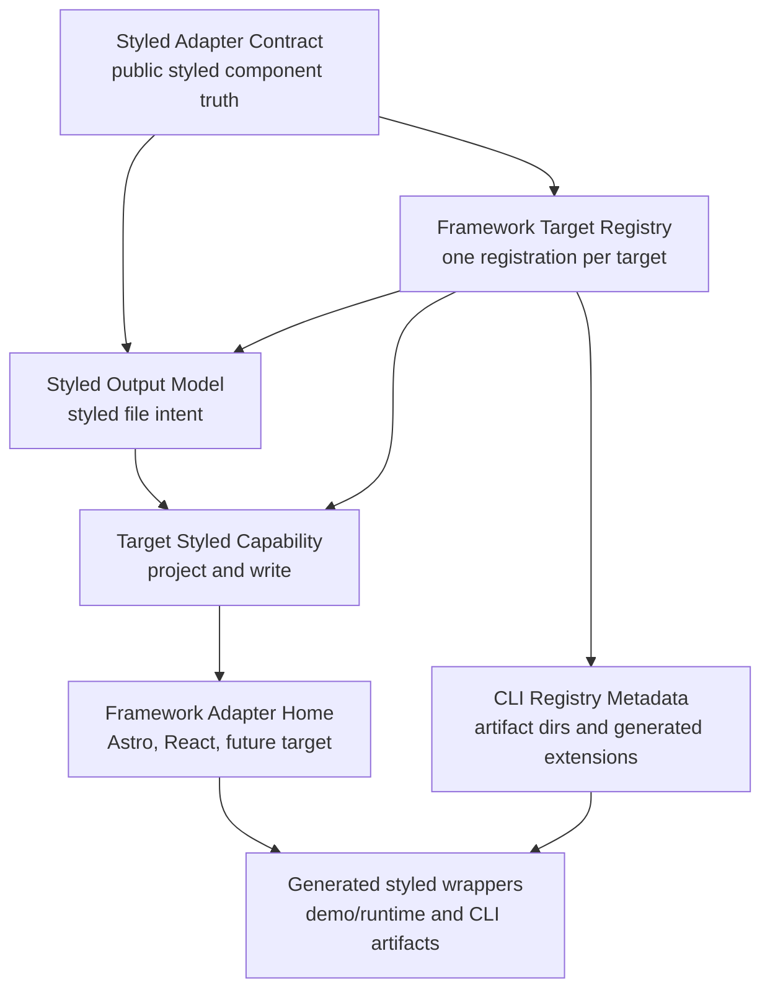

# Adapter Vocabulary

Status: current
Date: 2026-07-01

This document is the current vocabulary guide for Starwind's portable runtime adapter generator.
It names the architecture in terms that are easier to explain than the first implementation names.

## Accepted Terms

| Accepted term            | Previous source term       | Meaning                                                                                                                                                                                                                                                                        |
| ------------------------ | -------------------------- | ------------------------------------------------------------------------------------------------------------------------------------------------------------------------------------------------------------------------------------------------------------------------------ |
| Runtime Adapter Contract | `PrimitiveAdapterContract` | Source-of-truth adapter facts derived from Runtime-backed primitive families: parts, props, refs, events, setters, form metadata, presence, floating behavior, initial markup, and escape hatches.                                                                             |
| Primitive Inventory      | New explicit source        | Framework-neutral primitive identity list for Runtime contract association, generation strategy, package exports, Runtime facade types/values, manual helper facades, and CLI vendoring facts.                                                                                 |
| Generic Adapter Plan     | `PrimitiveRenderPlan`      | Framework-neutral adapter plan for components whose adapter shape can be described by shared logic.                                                                                                                                                                            |
| Adapter Family Plan      | `family-builder`           | A reusable Generic Adapter Plan family for repeated shapes such as boolean controls, grouped controls, disclosure/presence, native overlays, floating overlays, viewport measurement, and form coordinators.                                                                   |
| Specialized Adapter Spec | `ComponentAdapterSpec`     | A component-specific adapter recipe for shapes that need named concepts such as collections, composite menu branches, visual slots, carousel engines, or toast manager exports.                                                                                                |
| Adapter Output Model     | New explicit seam          | Framework-neutral generated-file description consumed by target Framework Adapters. It carries files, imports, props, refs, lifecycle, events, context, portals, exports, helper files, and type facades.                                                                      |
| Styled Output Model      | New explicit seam          | Framework-neutral styled generated-file description consumed by target styled capabilities. It carries styled files, exports, variants, CSS side effects, primitive references, composed component references, render trees, props, destructuring, and client behavior intent. |

The old names still appear in a small number of source symbols retained for compatibility. In
current docs, old names should be treated as source-symbol references or historical context.

## Mental Model

Runtime owns behavior. Primitive Inventory owns which primitive families exist and how they are
published or vendored. Adapter contracts and plans own framework-facing facts. Framework Adapters
translate those facts into Astro, React, and future target syntax.

The primitive flow produces an Adapter Output Model before target-specific Framework Adapter code
runs:

In source, `primitive-route-free-generator.ts` resolves a target registration, then calls
`targetRegistration.primitive.outputModel.write(...)`. Specialized Adapter Spec output first runs
through `targetRegistration.primitive.outputModel.projectSpecialized(...)`. Generic Adapter Plan
output goes through the structured Adapter Output Model family registry; Adapter Family Plan locality
means a family module should own matching, validation, fact extraction, and output-model construction
when that family is deepened.

The styled flow is separate on purpose. It starts from Styled Adapter Contracts, projects them into a
Styled Output Model, then asks the registered framework target's styled capability to write the
target syntax:

The Styled Output Model is not the Primitive Adapter Output Model. It exists because styled
generation owns different facts: Tailwind variant files, CSS side effects, composed styled component
references, primitive-wrapper ergonomics, and styled client behavior intent. Keeping the models
separate prevents styled composition concerns from leaking into Primitive adapter generation. Both
models can share small framework-neutral helper ideas, but framework syntax belongs in the target
home.
In source, the target styled flow is `targetRegistration.styled.project(...)` followed by
`targetRegistration.styled.write(...)`. The project step creates target-scoped Styled Output Model
groups; the write step sends those groups to target-local styled writer modules.

The Framework Adapter layer translates the Adapter Output Model into framework syntax: file format,
props, refs, lifecycle setup/cleanup, events, slots/children, context, portals/teleports, attribute
names, package exports, and type facades. It must not implement Runtime behavior such as focus
management, collection mutation, typeahead, positioning, validation, drag math, carousel physics, or
toast scheduling.

This is not "simple components versus complex components." Some behaviorally complex components
fit an Adapter Family Plan because their adapter shape is reusable. Specialized Adapter Specs are
for component-specific adapter vocabulary, not for moving behavior out of Runtime.

Primitive generation is route-free for component targets. New framework work should add or update
one target home plus one target registration, then run conformance/output checks. It should not add
`renderers/primitives/<component>/<target>.ts` files. Manual helper facades such as Theme are
declared in the central manual generator list rather than in component target folders.

## Framework Adapter Home Responsibilities

A framework author should work inside one target home:

- `scripts/portable-runtime/renderers/framework-adapters/<target>/`

The target is then registered once in the central Framework Adapter target registry. The build path
uses that registration for primitive package generation, manual helper facades, primitive output
writing, target styled capabilities, CLI registry artifact metadata, target metadata, and static
family printer lookup.

Target homes own framework-specific syntax and projection:

- file envelopes and extensions
- imports and type imports
- props, default values, native attributes, and boolean attributes
- refs and ref composition
- lifecycle setup, cleanup, effects, and duplicate-init protection
- event/callback projection
- children, slots, snippets, or render functions
- context/provider or provide/inject projection
- portals, teleports, or container ownership
- helper files and type facades
- primitive output writers and package exports
- styled output projectors, writers, conformance print hooks, and target-local styled syntax modules
- CLI registry artifact metadata such as generated import candidate extensions and output roots
- target-local family printers for Adapter Output Model families that need framework syntax

Equivalent target-local helper modules should expose the same high-level capability names or object
shapes across framework homes even when their implementation is framework-specific. For example,
Astro and React may project lifecycle differently, but both target homes should make it clear where
lifecycle projection lives.

Shared toolkit modules must remain framework-neutral. They may select plans, validate
contract-owned facts, describe Adapter Output Models, and dispatch through the central target
registry. They must not print Astro, React, Vue, Solid, or Svelte syntax. Runtime behavior must stay
in `packages/runtime`; adapters only connect props, refs, events, lifecycle hooks, markup, and helper
files to Runtime controllers.

For normal future framework work, the intended authoring path is one target home plus one target
registration. Shared generator modules should discover the target through the registry and call the
same high-level capability names. If a future Vue, Solid, or Svelte target needs a different file
extension, local import graph rule, or styled artifact root, that metadata belongs in the target
registration rather than in shared CLI generator branches.

## Package-Layer Terms

"Primitive adapter" remains valid when talking about the public framework packages and unstyled
parts. For example, `packages/astro` and `packages/react` still contain generated Primitive
adapters. The rename is about the internal contract and generator vocabulary, not public package
identity.

Do not rename public package APIs, component namespaces, component subpaths, registry component IDs,
runtime data attributes, or CLI commands as part of this vocabulary cleanup.

## Current Buckets

Adapter Family Plan components:

- `button`
- `toggle`
- `fieldset`
- `input`
- `progress`
- `form`
- `switch`
- `checkbox`
- `radio`
- `collapsible`
- `toggle-group`
- `radio-group`
- `checkbox-group`
- `avatar`
- `scroll-area`
- `popover`
- `dialog`
- `alert-dialog`
- `drawer`

Specialized Adapter Spec components:

- `carousel`
- `field`
- `slider`
- `tabs`
- `accordion`
- `input-otp`
- `tooltip`
- `preview-card`
- `dropzone`
- `menu`
- `navigation-menu`
- `context-menu`
- `select`
- `sidebar`
- `combobox`
- `toast`

Custom islands:

- None.

Future framework tracer-only fixtures:

- `button/vue`
- `toggle/vue`
- `collapsible/vue`
- `select/vue`
- `menu/vue`
- `navigation-menu/vue`
- `combobox/vue`
- `button/solid`
- `toggle/solid`
- `collapsible/solid`
- `select/solid`
- `menu/solid`
- `navigation-menu/solid`
- `combobox/solid`

These fixtures remain non-shipping. They do not imply package exports, CLI registry entries, demo
dependencies, or public framework support claims.

Manual helper facades:

- `theme`

Theme is not a Runtime-backed component adapter. It exposes Runtime theme utilities and the Astro
`ThemeInitScript` helper through the same primitive package inventory, with the manual exception
declared centrally.

## Runtime Boundary

The vocabulary rename must preserve the accepted Runtime boundary. Runtime keeps ownership of:

- focus management and keyboard behavior
- pointer math and drag workflows
- collection mutation and typeahead
- geometry, placement, and Floating UI updates
- hidden input synchronization and form reset behavior
- field validation discovery and ARIA synchronization
- Embla carousel lifecycle, measurement, and physics
- toast manager state, template cloning, timers, stacking, swipe dismissal, updates, and callbacks
- animation cleanup and duplicate initialization protection

Adapter generator layers may describe the facts needed to connect those behaviors to a framework,
but they must not reimplement the behavior.
